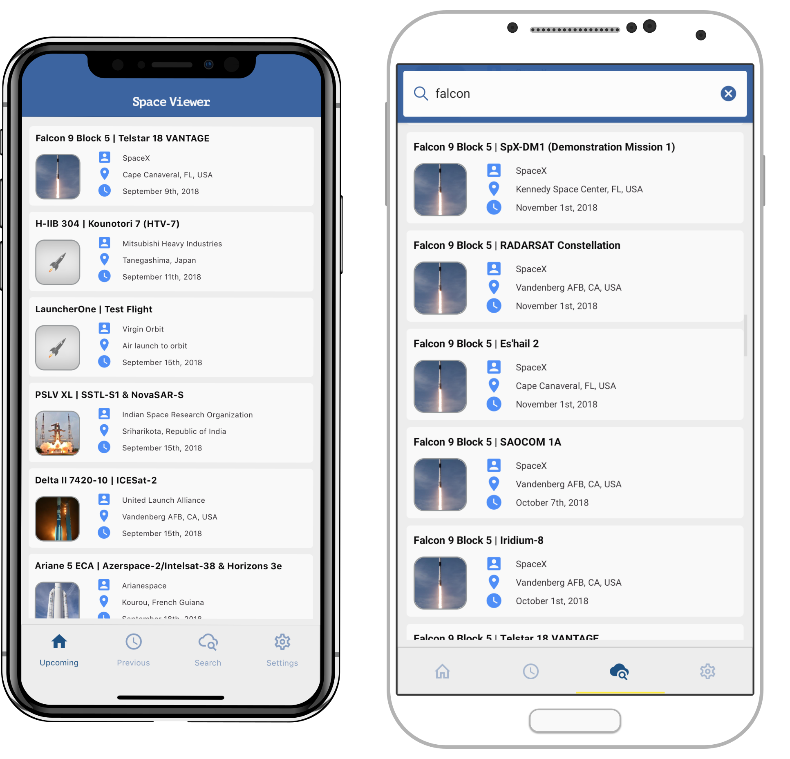

# Space Viewer - Rocket Infos

This is the source code for the iOS App ['Space Viewer - Rocket Infos'](https://itunes.apple.com/us/app/space-viewer-rocket-infos/id1434055829?ls=1&mt=8) and Android App ['Space Viewer - Information about Rocket Launches'](https://play.google.com/store/apps/details?id=com.mariusreimer.spaceviewer). You can see lots of information about rocket space launches from all over the world! Want to know at which location it will launch? Or do you want to see its live stream? All the information are bundled in this app.

This includes rocket launches from SpaceX, NASA, ROSCOSMOS, ISRO, ULA and many more!

## Tech Stack

* React Native (without Expo)
* Code Push by Microsoft App Center
* Redux-Saga for asynchronous actions
* Moment.Js for date operations

## Build & Run
Should be as easy as:

      yarn
      yarn run-android
      yarn run-ios

## Credits / Special Thanks

* All the data that is publicly available via the [LaunchLibrary.net](https://launchlibrary.net) API.
* Icon made by [Freepik](https://www.freepik.com) from [www.flaticon.com](https://www.flaticon.com)

## License
Copyright © 2018 Marius Reimer

Distributed under the [Apache 2 License](http://www.apache.org/licenses/LICENSE-2.0.html).
